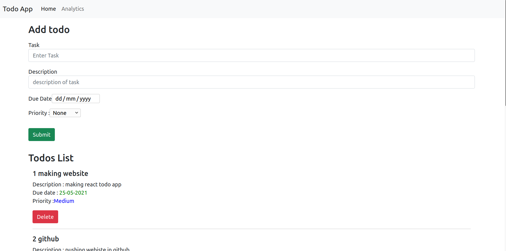

# TODO REACT APP

This is a TODO Website build in React js.

## Getting started

* fork the repository using `git pull <repo url>` command on the desired folder.
* `cd <foldername>` to move to the todo repository folder.
* run `npm install` to install all react dependency (your current location should be inside folder)
* run `npm start` to host app at http://localhost:3000/

## Techstack used

1. React 
2. React States 
3. React Routing-dom
4. bootstrap

## UI

1. Home page 

2. Analytics Page
 

## Additional Features

1. sorting features for sorting todos according to Due date, priority or Date Added.
2. automatically update color of due date as it came near.
3. similarly different color for different priorities.
 
